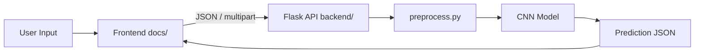

# Handwritten Character Recognition System

**CodeAlpha Internship Project**

A full-stack deep learning application that recognizes handwritten **digits (0–9)** and **English letters (A–Z)** using Convolutional Neural Networks (CNNs).

## Architecture



| Layer | Technology |
|-------|------------|
| Frontend | HTML, CSS, Vanilla JavaScript |
| Backend | Python 3.11+, Flask |
| ML | TensorFlow/Keras, OpenCV, NumPy |
| Datasets | MNIST, EMNIST Letters |

## Project Structure

```
handwritten_character_recognition/
├── analysis/              # Jupyter notebooks (exploration & evaluation)
│   ├── model_1.ipynb      # MNIST digit CNN
│   └── model_2.ipynb      # EMNIST letters CNN
├── backend/               # Flask API & training scripts
│   ├── app.py
│   ├── model.py
│   ├── preprocess.py
│   ├── predict.py
│   ├── train.py           # Wrapper: --model digit|character|both
│   ├── train_digit.py
│   ├── train_character.py
│   ├── training_utils.py
│   ├── requirements.txt
│   ├── tests/
│   └── saved_models/
├── docs/                  # Frontend web application
├── screenshots/           # Demo images (add your own)
├── run.sh                 # Start backend + frontend
└── requirements-analysis.txt
```

## Quick Start

### 1. Install dependencies (Python 3.11+)

```bash
cd backend
python -m venv venv
source venv/bin/activate   # Windows: venv\Scripts\activate
pip install -r requirements.txt
```

### 2. Train models

```bash
# Train both models
python train.py --model both

# Or individually
python train_digit.py
python train_character.py
```

Models are saved to `backend/saved_models/`:
- `digit_model.keras`
- `character_model.keras`

> Legacy notebook filenames (`mnist_cnn.keras`, `emnist_cnn.keras`) are also supported.

### 3. Run the application

**Option A — one command:**

```bash
chmod +x run.sh
./run.sh
```

**Option B — separate terminals:**

```bash
# Terminal 1 — API
cd backend && python app.py

# Terminal 2 — Frontend
python -m http.server 8080 --directory docs
```

- Frontend: http://localhost:8080  
- API: http://localhost:5000  

### 4. Run tests

```bash
cd backend
pytest tests/ -v
```

## API Endpoints

| Method | Endpoint | Description |
|--------|----------|-------------|
| GET | `/` | Service status |
| GET | `/health` | Health + model availability |
| POST | `/predict-digit` | Digit prediction |
| POST | `/predict-character` | Letter prediction |

### Example request (JSON)

```bash
curl -X POST http://localhost:5000/predict-digit \
  -H "Content-Type: application/json" \
  -d '{"image": "data:image/png;base64,...", "input_source": "canvas"}'
```

### Example response

```json
{
  "prediction": "7",
  "confidence": 99.21,
  "inference_time": "10 ms",
  "inference_time_ms": 10,
  "input_source": "canvas",
  "top_predictions": [
    {"label": "7", "confidence": 99.21},
    {"label": "1", "confidence": 0.45}
  ],
  "preprocessed_preview": "data:image/png;base64,...",
  "low_confidence": false
}
```

## Features

- **Three input methods:** canvas drawing, image upload, camera capture
- **MNIST-style preprocessing:** centering, padding, grayscale, 28×28 resize
- **Top-3 predictions** and **28×28 model input preview** in the UI
- **Low-confidence warnings** when prediction confidence &lt; 70%
- **Independent model loading** — one model can work without the other

## Screenshots

Add demo screenshots to the [`screenshots/`](screenshots/) folder for your portfolio README.

Suggested captures:
- Home page / hero section
- Digit prediction on canvas
- Character prediction with top-3 results
- Camera capture workflow
- 28×28 preprocessed preview panel

## Analysis Notebooks

```bash
pip install -r requirements-analysis.txt
jupyter notebook analysis/
```

Notebooks use the same architectures defined in `backend/model.py`.

## License

CodeAlpha Internship Project.
